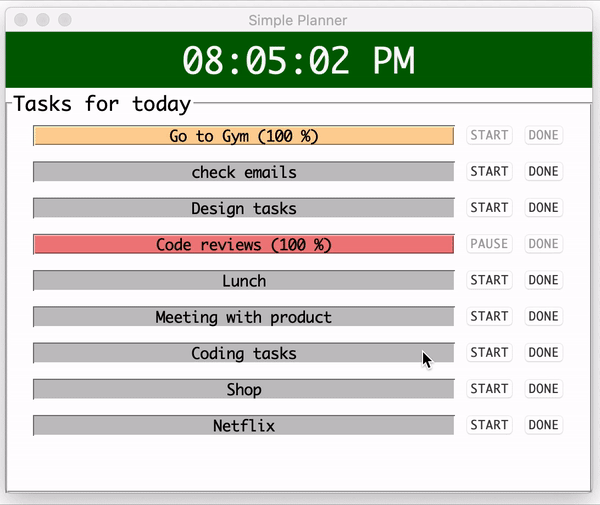
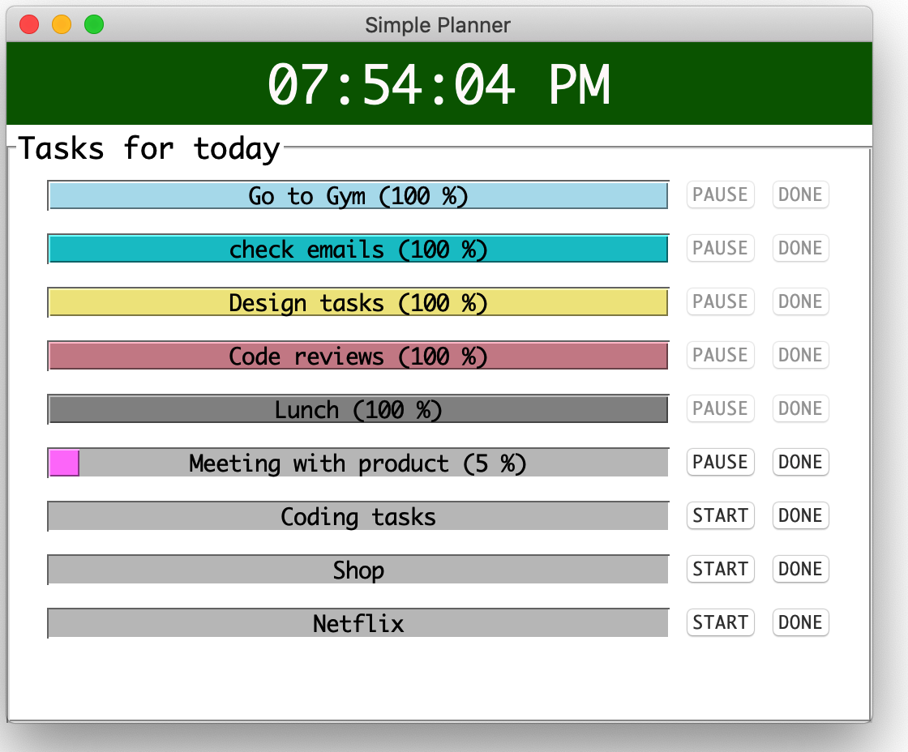

# On Target (Yet 'A'nother Day Planner!)

<em>So what is On Target?</em>

It is a simple day planner. It is purposefully designed to be simple to enable ease of use. You write your tasks and duration in a tsv file and start using a simple command. If you are used to <em>Stickes</em>, this is probably the next progression.

<em>It allows you to track tasks, estimate and knock them off as you go about  your day.</em>



## Requirements

```
Python 3.+
```

## How do I use it?

  * STEP1 - create a TSV file and name it as `today.tsv`. This file has two columns , task_name and duration. NOTE - `m` stands for minutes, `h` for hours in duration.

	`today.tsv`
	```
	Go to Gym	1h
	check emails	30m
	Design tasks	2h
	Code reviews	1h
	Lunch	1h
	Meeting with product	1h
	Coding tasks	3h
	Shop	1h
	Netflix	2h	
	```

  * STEP2 - Start the app using following command
  ```
  > python on_target.py
  ```

  

## What's next?

I do not plan to evolve it further, but feel free to provide pull requests or fork build on it.

A few thoughts around what could be next -

  * Ability to play sounds at particular milestones
  * Stream a youtube playlist or spotify list while you work on your tasks
  * Track how you can improve based on your estimates, number of pauses, marking as done before you start etc.
  * Support Themes
  * Alert deadlines, schedule a particular time etc.
  and more ...
